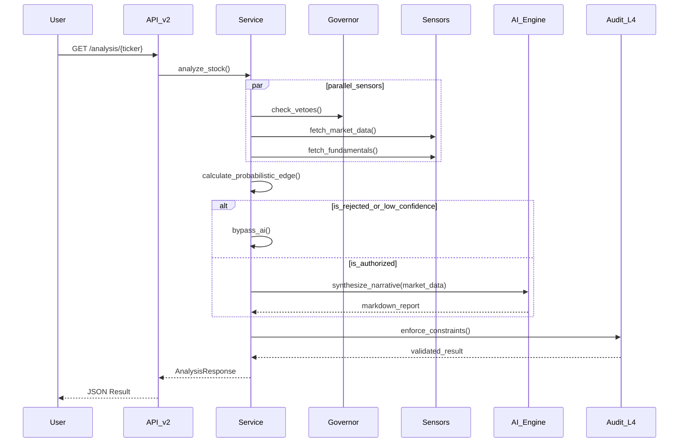

# QuantStock-Pro: System Design & Architecture

## 1. Architectural Philosophy
Built on the **PRAR** (Perceive, Reason, Act, Refine) workflow, evolved for institutional-grade reliability. The core design principle is **Execution-First Architecture**, ensuring high-latency AI synthesis never gates critical trading decisions.

## 2. Dual-Engine Execution Model

### 2.1 The Fast Path (Deterministic Engine)
The Fast Path is the system's "reflex." It is responsible for low-latency, rule-based decision making.
*   **Latency Target**: < 500ms.
*   **Mechanism**: Pure Python logic, statistical signals, and a **Veto Registry**.
*   **Authority**: Canonical. It determines if a trade is `authorized`. If the Fast Path issues a `WAIT` or `REJECT` due to a veto (e.g., ADX < 20), the Slow Path is bypassed to save resources.

### 2.2 The Slow Path (Narrative Engine)
The Slow Path is the system's "brain." It provides deep synthesis and human-readable context.
*   **Latency Profile**: 10s - 30s.
*   **Mechanism**: Google Gemini Pro (LLM).
*   **Safety**: Gated by a **60-second Circuit Breaker**. 
*   **Constraint**: The Slow Path must strictly adhere to the `system.confidence` and `execution.action` defined by the Fast Path.

## 3. Decision Sequence Diagram

## 4. Decision Pipeline (Forensic Layers)

1.  **Layer 0: Pre-Screen (Governance)**: Immediate filtering based on earnings proximity, insider activity, and accrual quality (Sloan Ratio).
2.  **Layer 1: Sensors (Ingestion)**: Multi-horizon technical OHLCV and detailed financial statements from Polygon/Yahoo.
3.  **Layer 2: Scoring (Quantitative Edge)**: 
    - **Bayesian Engine**: Calculates P_Win based on regime-aware technical indicators.
    - **Quality Engine**: DCF and sector-relative fundamental grading.
4.  **Layer 3: Synthesis (Intelligence)**: Gemini LLM generates evidentiary reports in Markdown format.
5.  **Layer 4: Enforcement (Audit)**: Mandatory confidence capping and price-level alignment.

## 5. Institutional Guardrails
- **Confidence Ceiling**: Sub-horizon confidence cannot exceed the global system-assessed confidence.
- **Zero Silent Failures**: Every sensor exception is logged and reported via the `data_state_taxonomy`.
- **Mathematical Integrity**: Normalized signal components [-1, 1] across all scoring modules.
- **Accrual Quality Gating**: Sloan Ratio checks to detect earnings manipulation.
